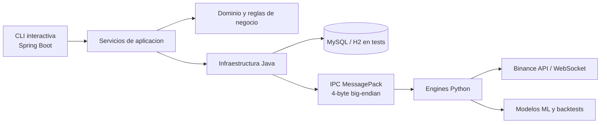

# CryptoApp

<p align="center">
	<strong>Plataforma experimental de trading algorítmico sobre criptomonedas</strong><br>
	Java 21 + Spring Boot 3.3.5 para la orquestación, Python 3.11+ para cálculo, ML y backtesting,
	con arquitectura hexagonal e IPC binario MessagePack.
</p>

<p align="center">
	
	
	
	
	
	
</p>

> CryptoApp no nace como un simple bot de señales, sino como un banco de pruebas reproducible para estudiar estrategias, validar hipótesis, comparar modelos predictivos y simular operativa sin dinero real. El proyecto forma parte del Trabajo de Fin de Grado de Alejandro Lopez Lopez en el Grado en Ingenieria Informatica de la Universidad de Murcia.

## Vision General

CryptoApp integra en un mismo flujo:

- descarga incremental de velas OHLCV desde Binance,
- calculo de indicadores tecnicos,
- backtesting clasico y asistido por IA,
- entrenamiento y optimizacion de modelos supervisados,
- paper trading en tiempo real,
- persistencia y contabilidad sobre carteras virtuales,
- generacion de resultados reproducibles en CSV y artefactos de modelos.

La aplicacion se ejecuta como una CLI interactiva, no como una API REST. Java coordina la sesion, la persistencia, la contabilidad y el ciclo de vida de las estrategias; Python actua como motor de calculo para fetch, indicadores, simulacion, inferencia, entrenamiento y optimizacion.

## Por Que Es Interesante

- Combina backend empresarial y analitica cuantitativa dentro de una sola base de codigo.
- Separa responsabilidades mediante arquitectura hexagonal, evitando mezclar dominio con detalles de infraestructura.
- Usa un puente Java-Python con serializacion MessagePack y framing de 4 bytes big-endian, en lugar de una integracion ad hoc.
- Permite comparar el baseline clasico con modelos de ML dentro del mismo entorno experimental.
- Nace de un TFG real y conserva un enfoque claramente academico y reproducible.

## Arquitectura



### Reparto de responsabilidades

| Capa | Tecnologia | Responsabilidad principal |
| --- | --- | --- |
| Orquestacion | Java 21 + Spring Boot | CLI, sesion, persistencia, contabilidad, coordinacion de procesos |
| Dominio | Java | wallets, posiciones, ledger, estrategias y casos de uso |
| Analitica | Python 3.11+ | fetch, indicadores, entrenamiento, optimizacion, inference |
| Persistencia | MySQL / H2 | velas, resultados, sesiones y pruebas |
| Comunicacion | MessagePack | contrato estable entre Java y Python |

## Capacidades Principales

| Area | Que hace |
| --- | --- |
| Gestion de usuarios | registro, login y sesion interactiva |
| Carteras virtuales | crea paper wallets y gestiona capital disponible y comprometido |
| Datos de mercado | descarga historicos de Binance y rellena huecos incrementalmente |
| Backtesting | ejecuta estrategias clasicas o guiadas por modelo |
| IA aplicada | entrena, evalua y optimiza modelos como LightGBM, XGBoost, randomForest, SVM o redes neuronales |
| Trading en tiempo real | lanza sesiones de paper trading con senales clasicas o predicciones del modelo |
| Resultados | persiste metricas, CSVs, modelos y logs para analisis posterior |

## Mapa Del Repositorio

```text
cryptoapp/
├── code/
│   ├── backendBotTrading/   # backend Java + CLI + persistencia + tests Maven
│   ├── scripts/             # engines Python: fetch, indicators, backtest, train, optimize, rt
│   └── strategies/          # estrategias Python cargadas dinamicamente
├── info/                    # apoyo tecnico, incluido el esquema SQL base
├── models/                  # artefactos de modelos entrenados
├── results/                 # CSVs de backtesting y optimizacion
├── logs/                    # logs de ejecucion
└── requirements.txt         # dependencias Python del proyecto
```

## Requisitos

- Java 21
- Maven 3.9+
- Python 3.11 o superior
- MySQL 8+ para ejecucion normal
- H2 para tests Java
- Entorno virtual Python con las dependencias de `requirements.txt`

## Puesta En Marcha

### 1. Clonar el repositorio

```bash
git clone https://github.com/alexlp04/cryptoapp.git
cd cryptoapp
```

### 2. Crear y preparar el entorno Python

```bash
python3.11 -m venv .venv
source .venv/bin/activate
pip install --upgrade pip
pip install -r requirements.txt
```

### 3. Hacer visible el venv desde el backend Java

El backend valida el ejecutable Python en `.venv/bin/python3` relativo al directorio desde el que se lanza `code/backendBotTrading`.

```bash
ln -sfn ../../.venv code/backendBotTrading/.venv
```

### 4. Configurar la base de datos

Crea el archivo `code/backendBotTrading/.env` con las variables minimas requeridas:

```env
DB_URL=jdbc:mysql://localhost:3306/bottradingdb?useSSL=false&allowPublicKeyRetrieval=true&serverTimezone=UTC
DB_USER=tu_usuario
DB_PASSWORD=tu_password
```

### 5. Arrancar la aplicacion

```bash
cd code/backendBotTrading
mvn spring-boot:run
```

Tambien puedes compilar el jar:

```bash
mvn clean package
```

## Flujo De Uso Recomendado

Un recorrido tipico dentro de la CLI es este:

```text
signup
login
mkpwallet
fetch
le
backtest
train
optimize
trade -v o trade -r
```

## Comandos CLI Destacados

| Categoria | Comando | Uso |
| --- | --- | --- |
| Usuarios | `signup`, `login`, `logout` | alta, autenticacion y cierre de sesion |
| Carteras | `mkpwallet`, `lw` | crea y lista paper wallets |
| Mercado | `fetch` | descarga velas historicas y rellena huecos |
| Estrategias | `le` | lista estrategias disponibles |
| Backtesting | `backtest` | simulacion historica clasica o con `-model` |
| Tiempo real | `trade`, `lsa`, `lsd`, `start`, `stop`, `term` | ciclo de vida de sesiones de paper trading |
| IA | `models`, `train`, `optimize` | catalogo, entrenamiento y busqueda de hiperparametros |

Ejemplos representativos:

```bash
# Descargar historico 1h para BTC y ETH
fetch -tf 1h -coins BTCUSDT ETHUSDT -d 365 --detect-gaps

# Ejecutar backtest clasico
backtest -strategy StressTestStrategy -tf 1h -coins BTCUSDT

# Entrenar un modelo
train -model lightgbm -tf 1h -coins BTCUSDT -strategy StressTestStrategy -d 365

# Optimizar hiperparametros
optimize -model lightgbm -tf 1h -coins BTCUSDT -strategy StressTestStrategy -d 365 -n-trials 30 -cv-folds 5

# Lanzar paper trading en tiempo real
trade -v -strategy StressTestStrategy -tf 1h -coins BTCUSDT
```

## Validacion Y Calidad

### Tests Java

```bash
cd code/backendBotTrading
mvn test
```

### Verificacion completa del backend

```bash
cd code/backendBotTrading
mvn verify
```

### Tests Python

```bash
source .venv/bin/activate
pytest code/scripts/tests -q
```

### E2E de entrenamiento

```bash
bash code/backendBotTrading/src/test/resources/e2e/train_neural_network_e2e.sh
```

## Referencias Del Proyecto

- Esquema SQL base: `info/tablas.sql`
- Configuracion Maven y calidad: `code/backendBotTrading/pom.xml`
- Configuracion Sonar: `code/backendBotTrading/sonar-project.properties`

> Nota: este snapshot del repositorio se centra en el codigo, los resultados y los artefactos de ejecucion. La memoria academica del TFG no forma parte de la raiz actual del proyecto.

## Artefactos Generados

Durante la ejecucion del proyecto se generan carpetas con bastante volumen:

- `models/` para modelos entrenados y metadatos,
- `results/` para CSVs de backtesting y optimizacion,
- `logs/` para logs de engines y sesiones.

Estos directorios son utiles para experimentacion y analisis, pero no conviene tratarlos como documentacion fuente ni subir artefactos pesados sin revisarlos antes.

## Estado Del Proyecto

CryptoApp es un proyecto academico real, funcional y con una base tecnica considerablemente mayor que la de una demo. Su objetivo principal no es vender una promesa de rentabilidad, sino ofrecer una infraestructura reproducible para estudiar estrategias cuantitativas, medir resultados y discutirlos con rigor.

## Autor

**Alejandro Lopez Lopez**  
Grado en Ingenieria Informatica  
Universidad de Murcia

---

> Este repositorio tiene fines academicos y experimentales. No constituye asesoramiento financiero ni una recomendacion de inversion.
