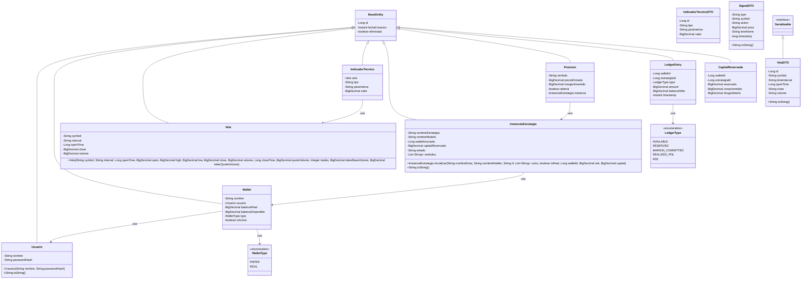

```mermaid
classDiagram
  class BaseEntity {
    -Long id
    -Instant fechaCreacion
    -boolean eliminado
  }

  class Usuario {
    -String nombre
    -String passwordHash
    +Usuario(String nombre, String passwordHash)
    +String toString()
  }

  class Wallet {
    -String nombre
    -Usuario usuario
    -BigDecimal balanceReal
    -BigDecimal balanceDisponible
    -WalletType type
    -boolean isActive
  }

  class Vela {
    -String symbol
    -String interval
    -Long openTime
    -BigDecimal close
    -BigDecimal volume
    +Vela(String symbol, String interval, Long openTime, BigDecimal open, BigDecimal high, BigDecimal low, BigDecimal close, BigDecimal volume, Long closeTime, BigDecimal quoteVolume, Integer trades, BigDecimal takerBaseVolume, BigDecimal takerQuoteVolume)
  }

  class IndicadorTecnico {
    -Vela vela
    -String tipo
    -String parametros
    -BigDecimal valor
  }

  class InstanciaEstrategia {
    -String nombreEstrategia
    -String nombreModelo
    -Long walletAsociada
    -BigDecimal capitalReservado
    -String estado
    -List~String~ simbolos
    +InstanciaEstrategia inicializar(String nombreEstra, String nombreModelo, String tf, List~String~ coins, boolean isReal, Long walletId, BigDecimal risk, BigDecimal capital)
    +String toString()
  }

  class Posicion {
    -String simbolo
    -BigDecimal precioEntrada
    -BigDecimal margenInvertido
    -boolean abierta
    -InstanciaEstrategia instancia
  }

  class LedgerEntry {
    -Long walletId
    -Long estrategiaId
    -LedgerType type
    -BigDecimal amount
    -BigDecimal balanceAfter
    -Instant timestamp
  }

  class CapitalReservado {
    -Long walletId
    -Long estrategiaId
    -BigDecimal reservado
    -BigDecimal comprometido
    -BigDecimal riesgoAbierto
  }

  class VelaDTO {
    -Long id
    -String symbol
    -String timeInterval
    -Long openTime
    -String close
    -String volume
    +String toString()
  }

  class IndicadorTecnicoDTO {
    -Long id
    -String tipo
    -String parametros
    -BigDecimal valor
  }

  class SignalDTO {
    -String type
    -String symbol
    -String action
    -BigDecimal price
    -String timeframe
    -long timestamp
    +String toString()
  }

  class WalletType {
    <<enumeration>>
    PAPER
    REAL
  }

  class LedgerType {
    <<enumeration>>
    AVAILABLE
    RESERVED
    MARGIN_COMMITTED
    REALIZED_PNL
    FEE
  }

  class Serializable {
    <<interface>>
  }

  BaseEntity <|-- Usuario
  BaseEntity <|-- Wallet
  BaseEntity <|-- Vela
  BaseEntity <|-- IndicadorTecnico
  BaseEntity <|-- InstanciaEstrategia
  BaseEntity <|-- Posicion
  BaseEntity <|-- LedgerEntry
  BaseEntity <|-- CapitalReservado

  Serializable <|-- VelaDTO

  Wallet --> Usuario : usa
  Wallet --> WalletType : usa
  IndicadorTecnico --> Vela : usa
  Posicion --> InstanciaEstrategia : usa
  LedgerEntry --> LedgerType : usa
  InstanciaEstrategia --> Wallet : usa
```
