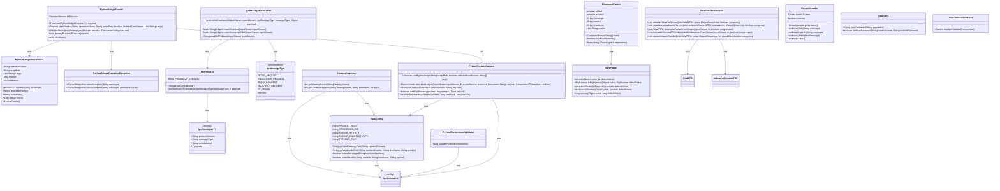

```mermaid
classDiagram
  class PythonBridgeFacade {
    -ExecutorService ioExecutor
    +T execute(PythonBridgeRequest~T~ request)
    +Process startProcess(String operationName, String scriptPath, boolean redirectErrorStream, List~String~ args)
    +Future~Void~ drainStderrAsync(Process process, Consumer~String~ onLine)
    +void destroyProcess(Process process)
    +void shutdown()
  }

  class PythonBridgeRequest~T~ {
    -String operationName
    -String scriptPath
    -List~String~ args
    -long timeout
    -int maxRetries
    +Builder~T~ builder(String scriptPath)
    +String operationName()
    +String scriptPath()
    +List~String~ args()
    +int maxRetries()
  }

  class PythonBridgeExecutionException {
    +PythonBridgeExecutionException(String message)
    +PythonBridgeExecutionException(String message, Throwable cause)
  }

  class IpcEnvelope~T~ {
    <<record>>
    +String protocolVersion
    +String messageType
    +String correlationId
    +T payload
  }

  class IpcMessagePackCodec {
    +void writeEnvelope(OutputStream outputStream, IpcMessageType messageType, Object payload)
    +Map~String,Object~ readEnvelope(InputStream inputStream)
    +Map~String,Object~ readEnvelopeOrNull(InputStream inputStream)
    +String readUtf8Fallback(InputStream inputStream)
  }

  class IpcProtocol {
    -String PROTOCOL_VERSION
    +String newCorrelationId()
    +IpcEnvelope~T~ envelope(IpcMessageType messageType, T payload)
  }

  class IpcMessageType {
    <<enumeration>>
    FETCH_REQUEST
    INDICATORS_REQUEST
    TRAIN_REQUEST
    BACKTEST_REQUEST
    RT_SIGNAL
    ERROR
  }

  class PathConfig {
    -String PROJECT_ROOT
    -String STRATEGIES_DIR
    -String ENGINE_RT_PATH
    -String ENGINE_BACKTEST_PATH
    -String FETCHER_PATH
    +String getValidStrategyPath(String nombreEntrada)
    +String getValidModelPath(String nombreModelo, String timeframe, String symbol)
    +boolean existeEstrategia(String nombreAlgoritmo)
    +boolean existeModelo(String modelo, String timeframe, String symbol)
  }

  class PythonProcessSupport {
    +Process startPythonScript(String scriptPath, boolean redirectErrorStream, String[] args)
    +Future~Void~ drainLinesAsync(InputStream inputStream, ExecutorService executor, Consumer~String~ onLine, Consumer~IOException~ onError)
    +void writeUtf8(OutputStream outputStream, String payload)
    +boolean waitFor(Process process, long timeout, TimeUnit unit)
    +void destroyForcibly(Process process, long waitTime, TimeUnit unit)
  }

  class DataSerializationUtils {
    +void serializeVelasToStream(List~VelaDTO~ velas, OutputStream out, boolean compress)
    +void serializeIndicadorestoStream(List~IndicadorTecnicoDTO~ indicadores, OutputStream out, boolean compress)
    +List~VelaDTO~ deserializeVelasFromStream(InputStream in, boolean compressed)
    +List~IndicadorTecnicoDTO~ deserializeIndicadoresFromStream(InputStream in, boolean compressed)
    +void streamVelasInChunks(List~VelaDTO~ velas, OutputStream out, int chunkSize, boolean compress)
  }

  class StrategyInspector {
    +int getWarmupPeriod(String strategyName)
    +int getCandlesRequired(String strategyName, String timeframe, int days)
  }

  class PythonEnvironmentValidator {
    +void validatePythonEnvironment()
  }

  class CommandParser {
    -boolean isReal
    -boolean isVirtual
    -String estrategia
    -String modelo
    -String timeframe
    -List~String~ coins
    +CommandParser(String[] parts)
    +boolean hasErrorSintaxis()
    +Map~String,Object~ getHyperparams()
  }

  class ConsoleLoader {
    -Thread loaderThread
    -boolean running
    +ConsoleLoader getInstance()
    +void startDots(String message)
    +void startSpinner(String message)
    +void stop(String finalMessage)
    +void stopClear()
  }

  class SafeParser {
    +int toInt(Object value, int defaultValue)
    +BigDecimal toBigDecimal(Object value, BigDecimal defaultValue)
    +double toDouble(Object value, double defaultValue)
    +boolean toBoolean(Object value, boolean defaultValue)
    +long toLong(Object value, long defaultValue)
  }

  class HashUtils {
    +String hashPassword(String password)
    +boolean verificarPassword(String rawPassword, String hashedPassword)
  }

  class EnvironmentValidator {
    +Dotenv loadAndValidateEnvironment()
  }

  class AppConstants {
    <<utility>>
  }

  class VelaDTO
  class IndicadorTecnicoDTO

  PythonBridgeFacade --> PythonBridgeRequest~T~ : usa
  PythonBridgeFacade --> PythonProcessSupport : usa
  PythonBridgeFacade --> PythonBridgeExecutionException : usa

  IpcMessagePackCodec --> IpcMessageType : usa
  IpcMessagePackCodec --> IpcProtocol : usa
  IpcProtocol --> IpcEnvelope~T~ : usa

  DataSerializationUtils --> VelaDTO : usa
  DataSerializationUtils --> IndicadorTecnicoDTO : usa

  StrategyInspector --> PathConfig : usa
  StrategyInspector --> AppConstants : usa
  PathConfig --> AppConstants : usa
  PythonEnvironmentValidator --> AppConstants : usa
  PythonProcessSupport --> PathConfig : usa
  PythonProcessSupport --> AppConstants : usa

  CommandParser --> SafeParser : usa
```
