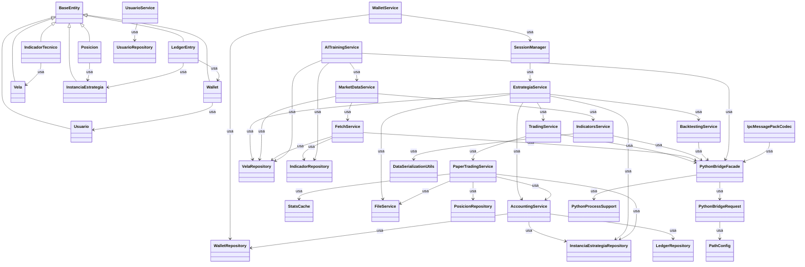

```mermaid
classDiagram
  class BaseEntity
  class Usuario
  class Wallet
  class Vela
  class IndicadorTecnico
  class InstanciaEstrategia
  class Posicion
  class LedgerEntry

  class UsuarioService
  class WalletService
  class AccountingService
  class EstrategiaService
  class TradingService
  class PaperTradingService
  class MarketDataService
  class FetchService
  class IndicatorsService
  class BacktestingService
  class AITrainingService
  class SessionManager
  class StatsCache
  class FileService

  class UsuarioRepository
  class WalletRepository
  class VelaRepository
  class IndicadorRepository
  class InstanciaEstrategiaRepository
  class PosicionRepository
  class LedgerRepository

  class PythonBridgeFacade
  class DataSerializationUtils
  class PythonBridgeRequest
  class IpcMessagePackCodec
  class PythonProcessSupport
  class PathConfig

  BaseEntity <|-- Usuario
  BaseEntity <|-- Wallet
  BaseEntity <|-- Vela
  BaseEntity <|-- IndicadorTecnico
  BaseEntity <|-- InstanciaEstrategia
  BaseEntity <|-- Posicion
  BaseEntity <|-- LedgerEntry

  UsuarioService --> UsuarioRepository : usa
  WalletService --> WalletRepository : usa
  WalletService --> SessionManager : usa
  SessionManager --> EstrategiaService : usa

  AccountingService --> WalletRepository : usa
  AccountingService --> InstanciaEstrategiaRepository : usa
  AccountingService --> LedgerRepository : usa

  EstrategiaService --> InstanciaEstrategiaRepository : usa
  EstrategiaService --> VelaRepository : usa
  EstrategiaService --> TradingService : usa
  EstrategiaService --> BacktestingService : usa
  EstrategiaService --> FileService : usa
  EstrategiaService --> AccountingService : usa

  TradingService --> PaperTradingService : usa
  TradingService --> PythonBridgeFacade : usa
  PaperTradingService --> PosicionRepository : usa
  PaperTradingService --> InstanciaEstrategiaRepository : usa
  PaperTradingService --> AccountingService : usa
  PaperTradingService --> StatsCache : usa
  PaperTradingService --> FileService : usa

  MarketDataService --> FetchService : usa
  MarketDataService --> IndicatorsService : usa
  MarketDataService --> VelaRepository : usa

  FetchService --> VelaRepository : usa
  FetchService --> IndicadorRepository : usa
  FetchService --> PythonBridgeFacade : usa

  IndicatorsService --> PythonBridgeFacade : usa
  IndicatorsService --> DataSerializationUtils : usa

  BacktestingService --> PythonBridgeFacade : usa
  AITrainingService --> PythonBridgeFacade : usa
  AITrainingService --> MarketDataService : usa
  AITrainingService --> VelaRepository : usa
  AITrainingService --> IndicadorRepository : usa

  PythonBridgeFacade --> PythonBridgeRequest : usa
  PythonBridgeFacade --> PythonProcessSupport : usa
  IpcMessagePackCodec --> PythonBridgeFacade : usa
  PythonBridgeRequest --> PathConfig : usa

  Wallet --> Usuario : usa
  IndicadorTecnico --> Vela : usa
  Posicion --> InstanciaEstrategia : usa
  LedgerEntry --> Wallet : usa
  LedgerEntry --> InstanciaEstrategia : usa
```
