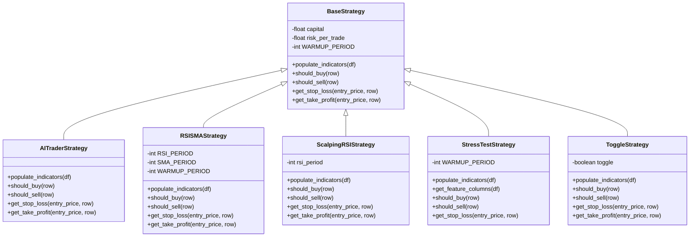

```mermaid
classDiagram
  class BaseStrategy {
    -float capital
    -float risk_per_trade
    -int WARMUP_PERIOD
    +populate_indicators(df)
    +should_buy(row)
    +should_sell(row)
    +get_stop_loss(entry_price, row)
    +get_take_profit(entry_price, row)
  }

  class AITraderStrategy {
    +populate_indicators(df)
    +should_buy(row)
    +should_sell(row)
    +get_stop_loss(entry_price, row)
    +get_take_profit(entry_price, row)
  }

  class RSISMAStrategy {
    -int RSI_PERIOD
    -int SMA_PERIOD
    -int WARMUP_PERIOD
    +populate_indicators(df)
    +should_buy(row)
    +should_sell(row)
    +get_stop_loss(entry_price, row)
    +get_take_profit(entry_price, row)
  }

  class ScalpingRSIStrategy {
    -int rsi_period
    +populate_indicators(df)
    +should_buy(row)
    +should_sell(row)
    +get_stop_loss(entry_price, row)
    +get_take_profit(entry_price, row)
  }

  class StressTestStrategy {
    -int WARMUP_PERIOD
    +populate_indicators(df)
    +get_feature_columns(df)
    +should_buy(row)
    +should_sell(row)
    +get_stop_loss(entry_price, row)
  }

  class ToggleStrategy {
    -boolean toggle
    +populate_indicators(df)
    +should_buy(row)
    +should_sell(row)
    +get_stop_loss(entry_price, row)
    +get_take_profit(entry_price, row)
  }

  BaseStrategy <|-- AITraderStrategy
  BaseStrategy <|-- RSISMAStrategy
  BaseStrategy <|-- ScalpingRSIStrategy
  BaseStrategy <|-- StressTestStrategy
  BaseStrategy <|-- ToggleStrategy
```
