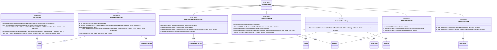

```mermaid
classDiagram
  class JpaRepository {
    <<interface>>
  }

  class VelaRepository {
    <<interface>>
    +List~Vela~ findBySymbolAndIntervalOrderByOpenTimeAsc(String symbol, String interval)
    +Long findMaxOpenTimeBySymbolAndInterval(String symbol, String interval)
    +void deleteBySymbolAndIntervalAndOpenTimeGreaterThanEqual(String symbol, String interval, Long openTime)
    +long countBySymbolAndIntervalAndOpenTimeBetween(String symbol, String interval, Long from, Long to)
    +Long findFirstInternalGapOpenTime(String symbol, String interval, Long from, Long to, Long step)
  }

  class IndicadorRepository {
    <<interface>>
    +List~IndicadorTecnico~ findByVela(Vela vela)
    +Optional~IndicadorTecnico~ findByVelaAndTipoAndParametros(Vela vela, String tipo, String parametros)
    +void deleteByVela(Vela vela)
    +void deleteByVelaSymbolAndIntervalAndOpenTimeGreaterThanEqual(String symbol, String interval, Long openTime)
    +List~IndicadorTecnico~ findByVelaIn(List~Vela~ velas)
  }

  class InstanciaEstrategiaRepository {
    <<interface>>
    +BigDecimal sumCapitalActivoByWallet(Long walletAsociada)
    +List~InstanciaEstrategia~ findByEstado(String estado)
    +List~InstanciaEstrategia~ findByWalletAsociadaAndEstado(Long walletAsociada, String estado)
    +Optional~InstanciaEstrategia~ findByIdWithLock(Long id)
  }

  class WalletRepository {
    <<interface>>
    +Optional~Wallet~ findByIdWithLock(Long id)
    +Optional~Wallet~ findByUsuarioAndNombre(Usuario usuario, String nombre)
    +List~Wallet~ findByUsuarioOrderByNombre(Usuario usuario)
    +List~Wallet~ findByUsuarioAndTypeAndIsActiveFalseOrderByNombre(Usuario usuario, WalletType type)
    +boolean existsByUsuarioAndNombre(Usuario usuario, String nombre)
  }

  class UsuarioRepository {
    <<interface>>
    +boolean existsByNombre(String nombre)
    +Optional~Usuario~ findByNombreAndEliminadoFalse(String nombre)
    +Optional~Usuario~ findByIdAndEliminadoFalse(Long id)
  }

  class PosicionRepository {
    <<interface>>
    +Optional~Posicion~ findByInstanciaAndSimboloAndAbiertaTrue(InstanciaEstrategia instancia, String simbolo)
    +boolean existsByInstanciaAndSimboloAndAbiertaTrue(InstanciaEstrategia instancia, String simbolo)
  }

  class LedgerRepository {
    <<interface>>
    +List~LedgerEntry~ findByWalletIdOrderByTimestampDesc(Long walletId)
    +List~LedgerEntry~ findByEstrategiaIdOrderByTimestampDesc(Long estrategiaId)
  }

  class Vela
  class IndicadorTecnico
  class InstanciaEstrategia
  class Wallet
  class Usuario
  class Posicion
  class LedgerEntry
  class WalletType

  JpaRepository <|-- VelaRepository
  JpaRepository <|-- IndicadorRepository
  JpaRepository <|-- InstanciaEstrategiaRepository
  JpaRepository <|-- WalletRepository
  JpaRepository <|-- UsuarioRepository
  JpaRepository <|-- PosicionRepository
  JpaRepository <|-- LedgerRepository

  VelaRepository --> Vela : usa
  IndicadorRepository --> IndicadorTecnico : usa
  IndicadorRepository --> Vela : usa
  InstanciaEstrategiaRepository --> InstanciaEstrategia : usa
  WalletRepository --> Wallet : usa
  WalletRepository --> Usuario : usa
  WalletRepository --> WalletType : usa
  UsuarioRepository --> Usuario : usa
  PosicionRepository --> Posicion : usa
  PosicionRepository --> InstanciaEstrategia : usa
  LedgerRepository --> LedgerEntry : usa
```
