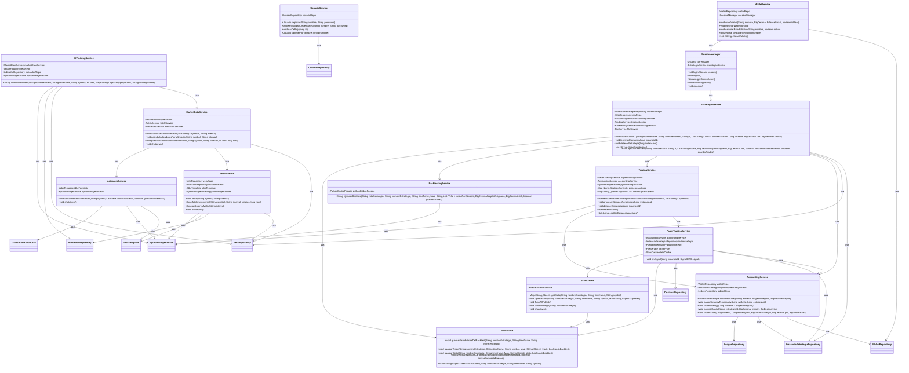

```mermaid
classDiagram
  class AccountingService {
    -WalletRepository walletRepo
    -InstanciaEstrategiaRepository estrategiaRepo
    -LedgerRepository ledgerRepo
    +InstanciaEstrategia activateStrategy(long walletId, long estrategiaId, BigDecimal capital)
    +void pauseStrategyTemporarily(Long walletId, Long estrategiaId)
    +void closeStrategy(Long walletId, Long estrategiaId)
    +void commitCapital(Long estrategiaId, BigDecimal margin, BigDecimal risk)
    +void closeTrade(Long walletId, Long estrategiaId, BigDecimal margin, BigDecimal pnl, BigDecimal risk)
  }

  class EstrategiaService {
    -InstanciaEstrategiaRepository instanciaRepo
    -VelaRepository velaRepo
    -AccountingService accountingService
    -TradingService tradingService
    -BacktestingService backtestingService
    -FileService fileService
    +void iniciarTradeRT(String nombreEstra, String nombreModelo, String tf, List~String~ coins, boolean isReal, Long walletId, BigDecimal risk, BigDecimal capital)
    +void terminarEstrategia(long instanciaId)
    +void detenerEstrategia(long instanciaId)
    +List~String~ listarEstrategias()
    +void ejecutarBacktest(String nombreEstra, String tf, List~String~ coins, BigDecimal capitalAsignado, BigDecimal risk, boolean limpiarBacktestsPrevios, boolean guardarTrades)
  }

  class TradingService {
    -PaperTradingService paperTradingService
    -AccountingService accountingService
    -PythonBridgeFacade pythonBridgeFacade
    -Map~Long,StrategyContext~ procesosActivos
    -Map~Long,Queue~SignalDTO~~ failedSignalsQueue
    +void ejecutarTradeEnTiempoReal(InstanciaEstrategia instancia, List~String~ symbols)
    +void procesarSignalesPendientes(Long instanciaId)
    +void detenerEstrategia(Long instanciaId)
    +void detenerTodo()
    +Set~Long~ getIdsEstrategiasActivas()
  }

  class PaperTradingService {
    -AccountingService accountingService
    -InstanciaEstrategiaRepository instanciaRepo
    -PosicionRepository posicionRepo
    -FileService fileService
    -StatsCache statsCache
    +void onSignal(Long instanciaId, SignalDTO signal)
  }

  class MarketDataService {
    -VelaRepository velaRepo
    -FetchService fetchService
    -IndicatorsService indicatorsService
    +void actualizarDatosMercado(List~String~ symbols, String interval)
    +void calcularIndicadoresParaSimbolo(String symbol, String interval)
    +void prepararDatosParaEntrenamiento(String symbol, String interval, int dias, long now)
    +void shutdown()
  }

  class FetchService {
    -VelaRepository velaRepo
    -IndicadorRepository indicadorRepo
    -JdbcTemplate jdbcTemplate
    -PythonBridgeFacade pythonBridgeFacade
    +void fetch(String symbol, String interval)
    +long fetchIncremental(String symbol, String interval, int dias, long now)
    +long getIntervalMillis(String interval)
    +void shutdown()
  }

  class IndicatorsService {
    -JdbcTemplate jdbcTemplate
    -PythonBridgeFacade pythonBridgeFacade
    +void calculateBasicIndicators(String symbol, List~Vela~ todasLasVelas, boolean guardarPrimeras50)
    +void shutdown()
  }

  class BacktestingService {
    -PythonBridgeFacade pythonBridgeFacade
    +String ejecutarBacktest(String rutaEstrategia, String nombreEstrategia, String timeframe, Map~String,List~Vela~~ velasPorSimbolo, BigDecimal capitalAsignado, BigDecimal risk, boolean guardarTrades)
  }

  class AITrainingService {
    -MarketDataService marketDataService
    -VelaRepository velaRepo
    -IndicadorRepository indicadorRepo
    -PythonBridgeFacade pythonBridgeFacade
    +String entrenarModelo(String nombreModelo, String timeframe, String symbol, int dias, Map~String,Object~ hyperparams, String strategyName)
  }

  class WalletService {
    -WalletRepository walletRepo
    -SessionManager sessionManager
    +void crearWallet(String nombre, BigDecimal balanceInicial, boolean isReal)
    +void eliminarWallet(long id)
    +void cambiarEstadoActivo(String nombre, boolean activo)
    +BigDecimal getBalance(String nombre)
    +List~String~ listarWallets()
  }

  class UsuarioService {
    -UsuarioRepository usuarioRepo
    +Usuario registrar(String nombre, String password)
    +boolean validarCredenciales(String nombre, String password)
    +void darDeBaja(long id)
    +Usuario obtenerPorNombre(String nombre)
  }

  class SessionManager {
    -Usuario currentUser
    -EstrategiaService estrategiaService
    +void login(Usuario usuario)
    +void logout()
    +Usuario getCurrentUser()
    +boolean isLoggedIn()
    +void cleanup()
  }

  class FileService {
    +void guardarEstadisticasDelBacktest(String nombreEstrategia, String timeframe, String jsonResultado)
    +void guardarTrade(String nombreEstrategia, String timeframe, String symbol, Map~String,Object~ trade, boolean isBacktest)
    +void guardarStats(String nombreEstrategia, String timeframe, Map~String,Object~ stats, boolean isBacktest)
    +void verificarYLimpiarCarpetaEstrategia(String nombreEstrategia, boolean limpiarBacktestsPrevios)
    +Map~String,Object~ leerStatsActuales(String nombreEstrategia, String timeframe, String symbol)
  }

  class StatsCache {
    -FileService fileService
    +Map~String,Object~ getStats(String nombreEstrategia, String timeframe, String symbol)
    +void updateStats(String nombreEstrategia, String timeframe, String symbol, Map~String,Object~ updates)
    +void flushAllToDisk()
    +void clearStrategy(String nombreEstrategia)
    +void shutdown()
  }

  class PythonBridgeFacade
  class DataSerializationUtils
  class VelaRepository
  class IndicadorRepository
  class InstanciaEstrategiaRepository
  class WalletRepository
  class UsuarioRepository
  class PosicionRepository
  class LedgerRepository
  class JdbcTemplate

  AccountingService --> WalletRepository : usa
  AccountingService --> InstanciaEstrategiaRepository : usa
  AccountingService --> LedgerRepository : usa

  EstrategiaService --> InstanciaEstrategiaRepository : usa
  EstrategiaService --> VelaRepository : usa
  EstrategiaService --> AccountingService : usa
  EstrategiaService --> TradingService : usa
  EstrategiaService --> BacktestingService : usa
  EstrategiaService --> FileService : usa

  TradingService --> PaperTradingService : usa
  TradingService --> AccountingService : usa
  TradingService --> PythonBridgeFacade : usa

  PaperTradingService --> AccountingService : usa
  PaperTradingService --> InstanciaEstrategiaRepository : usa
  PaperTradingService --> PosicionRepository : usa
  PaperTradingService --> FileService : usa
  PaperTradingService --> StatsCache : usa

  MarketDataService --> VelaRepository : usa
  MarketDataService --> FetchService : usa
  MarketDataService --> IndicatorsService : usa

  FetchService --> VelaRepository : usa
  FetchService --> IndicadorRepository : usa
  FetchService --> JdbcTemplate : usa
  FetchService --> PythonBridgeFacade : usa

  IndicatorsService --> JdbcTemplate : usa
  IndicatorsService --> PythonBridgeFacade : usa
  IndicatorsService --> DataSerializationUtils : usa

  BacktestingService --> PythonBridgeFacade : usa
  AITrainingService --> MarketDataService : usa
  AITrainingService --> VelaRepository : usa
  AITrainingService --> IndicadorRepository : usa
  AITrainingService --> PythonBridgeFacade : usa

  WalletService --> WalletRepository : usa
  WalletService --> SessionManager : usa
  UsuarioService --> UsuarioRepository : usa
  SessionManager --> EstrategiaService : usa
  StatsCache --> FileService : usa
```
